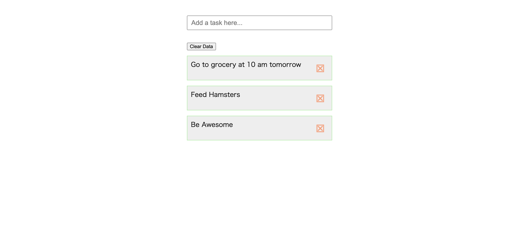

### TODO LIST
TODO LIST is a demonstration project made using HTML, CSS, Javascript. It uses local storage for storing todo list items. 

### What TODO LIST does ?  
-  Add  a new todo note
- Delete a todo note
- The data persists even after you close your browser

###  Here is a demo:

